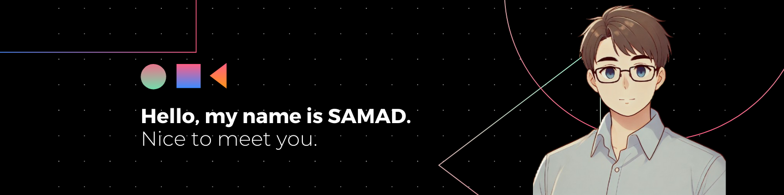

## Hi there 👋

I'm a passionate **Web Developer** with a drive for **problem-solving** and building impactful **solutions**. Currently based in France, I’m pursuing a degree in **web development** while constantly expanding my skills to tackle new and exciting projects. Alongside web development, I have a broad interest in all fields of IT, including **robotics**, **AI**, **blockchain**, **IOT**, **AR/VR** and more, always eager to explore the latest technologies and trends.

## 🔧 Tech Stack

- **Frontend**:
  
  
  

- **Backend**:
  
  
  
  

- **Cloud & Databases**:
  
  
  

- **Tools**:
  
  
  
  

## 🌱 Currently Exploring

- **SaaS and Startup Development**: Interested in launching innovative SaaS products with high impact potential.
- **Creative Educational Content**: Creating **guides** and **tutorials** to inspire and educate young developers, including **Figma prototyping** guides for kids.
- **Blockchain and IoT**: Developing ideas on blockchain-based **real estate** solutions with IoT integration.

## 🌍 Let's Connect!

- **LinkedIn**: [Abdessamad AJJA](www.linkedin.com/in/abdessamad-ajja) - Open to collaboration and networking.
- **Portfolio**: Coming Soon 🚀
